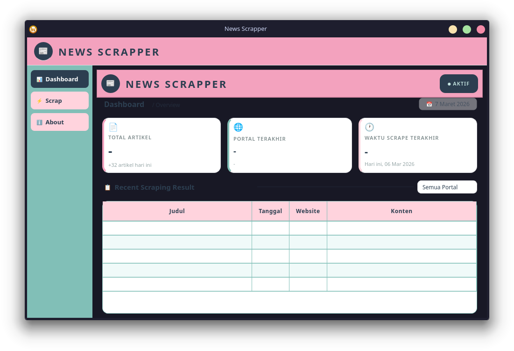
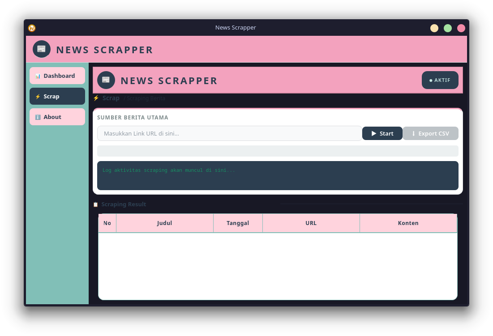
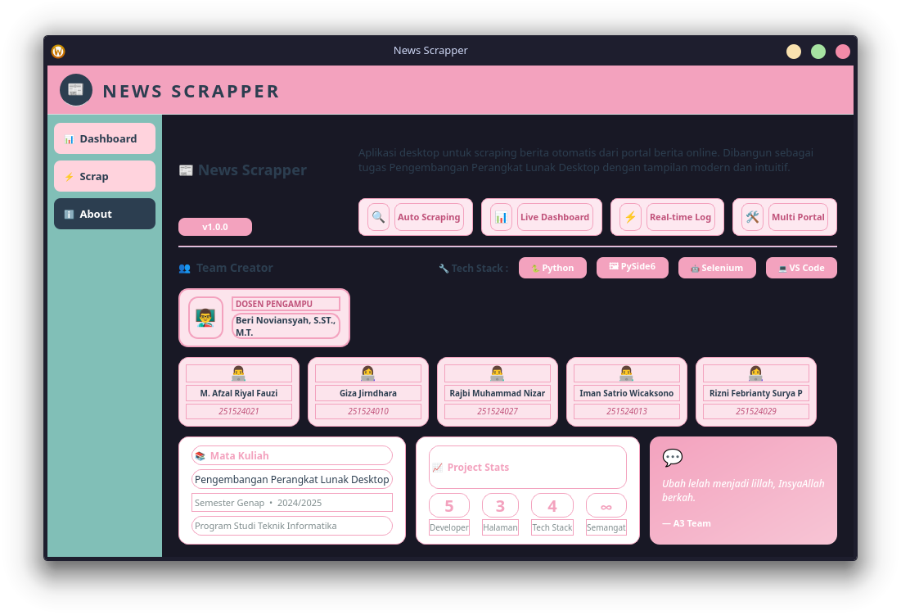

# Scraper Berita
Kelompok A3:
- PythonicHoshiyomi: Giza Jirndhara (251524010)
- Verianoo : Rajbi Muhammad Nizar (251524027)
- Imanstr26 : Iman Satrio Wicaksono (251524013)
- bijieu : Rizni Febrianty (251524029)
- riyalafzal-arch : M. Afzal Riyal Fauzi (251524021)

## Deskripsi Aplikasi

News Scrapper adalah aplikasi desktop berbasis Python yang digunakan untuk melakukan web scraping berita secara otomatis dari sebuah portal berita atau halaman kategori. Aplikasi ini memungkinkan pengguna mengambil informasi penting dari artikel seperti judul berita, tanggal publikasi, dan ringkasan konten, kemudian menampilkannya dalam bentuk tabel secara real-time.

Aplikasi ini dibangun menggunakan kombinasi GUI modern dengan PySide6 dan automation scraping menggunakan Selenium WebDriver. Dengan antarmuka desktop yang interaktif, pengguna dapat menjalankan proses scraping hanya dengan memasukkan URL halaman berita dan menekan tombol Start.

Selama proses scraping berlangsung, aplikasi akan menampilkan progress bar, log aktivitas, serta data artikel yang berhasil diambil secara langsung pada tabel hasil scraping. Hal ini membuat pengguna dapat memantau proses pengambilan data tanpa harus menunggu hingga proses selesai.

Selain menampilkan data hasil scraping, aplikasi juga menyediakan dashboard statistik sederhana yang menunjukkan informasi seperti jumlah artikel yang berhasil diambil, portal berita terakhir yang discrape, serta waktu scraping terakhir. Data yang telah dikumpulkan juga dapat diekspor ke file CSV untuk keperluan analisis lebih lanjut atau penyimpanan data.

Dengan arsitektur yang modular serta penggunaan worker thread untuk proses scraping, aplikasi tetap responsif dan tidak mengalami freeze pada antarmuka saat scraping berjalan.

Secara umum, News Scrapper dirancang sebagai aplikasi pembelajaran sekaligus alat praktis untuk memahami konsep web scraping, automation browser, multithreading, dan pengembangan aplikasi desktop menggunakan Python.


## First Setup 
```
python3 -m venv .venv
pip install requirements.txt
.venv/Scripts/activate # Windows
source .venv/bin/activate # Linux/Mac
pip install -r requirements.txt
```
## Preview

<p></p>
<p></p>
<p></p>

## Panduan
1. Pergi ke tab Scrape untuk memulai scraping
2. Masukan URL yang anda ingin scrape
3. Tekan start untuk memulai
4. Tunggu sampai progress bar selesai
5. Hasil scraping dapat di-export menggunakan tombol export yang ada di sebelah tombol start
6. Anda dapat melihat riwayat aktivitas di tab Dashboard
